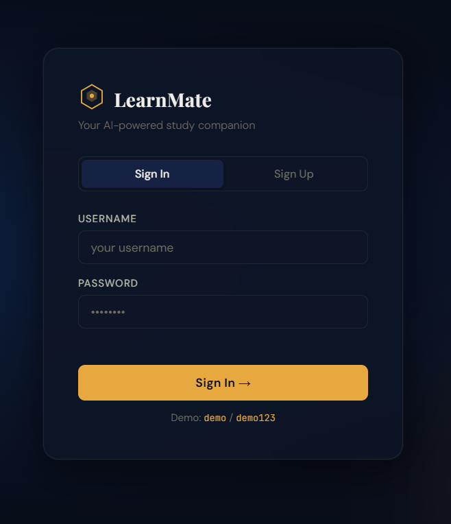
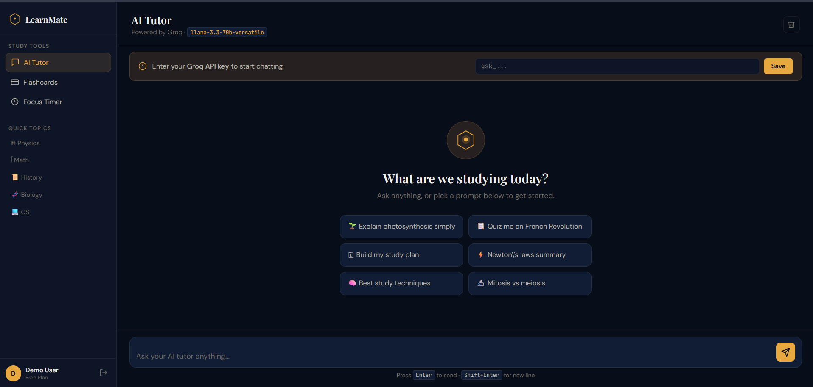

# LearnMate

LearnMate is an AI-powered study assistant built by **HTML, CSS, JavaScript**.

It helps students learn faster by providing explanations, flashcards, study tools, and a focus timer in one place.

The project uses the **Groq API** with **LLaMA 3.3 70B** to answer questions and support learning.

---

# Features

## AI Tutor

Ask questions and get clear, simple explanations for different subjects.

## Flashcard Generator

Enter any topic and create flashcards for a quick revision.

## Pomodoro Timer

Use a 25 minute focus timer to improve concentration while studying.

## Quick Study Prompts

prompts for:

* Mathematics
* Physics
* Biology
* History
* Computer Science

## Login & Signup

simple frontend authentication system for creating and accessing accounts

## Dark Mode

A clean dark theme for comfortable studying, especially at night

---

# Screenshots

### Login Page



### Main Dashboard



---

# Getting Started

## Clone the Repository

```bash
git clone https://github.com/abdelrahman-mo7amd/LearnMate.git
cd LearnMate
```

## Get a Groq API Key

1. Create an account at https://console.groq.com
2. Generate an API key
3. Save your API key securely

## Run the Project

Open the project directly:

```bash
open index.html
```
---

# Add Your API Key

Paste your Groq API key into the application.
The key will be saved in your browser using localStorage so you do not need to enter it every time.

---

# Login

Demo Account:

```text
Username: demo
Password: demo123
```

You can also create your own account.

Note: User accounts are stored locally and are not permanent.

---

# Project Structure

```text
LearnMate/
├── index.html
├── style.css
├── auth.js
├── chat.js
└── README.md
```
---

# Development Tracking

Coding time was tracked using Hackatime to monitor development progress.

---

# Notes

* API keys are stored in localStorage.
* User accounts are stored locally in the browser.
* The AI model can be changed in `chat.js`.
* If you encounter an issue, check the browser console for errors.

---

# License

This project is licensed under the MIT License.

You are free to use, modify, and distribute it.

---

# 👨‍💻 Author

Created by Abdelrahman Mohamed to provide students with a simple and effective study tool in one place.
